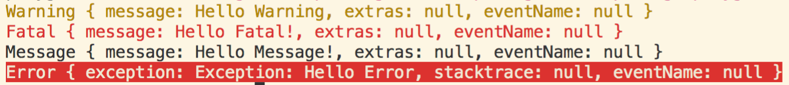

# lumberdash

[](https://travis-ci.com/jorgecoca/lumberdash)
[](https://codecov.io/gh/jorgecoca/lumberdash)
[](https://pub.dartlang.org/packages/lumberdash)


Do you need logs? Lumberdash is the answer! With a simple but powerful API, Lumberdash is the easiest way to record logs. 
And if that is not enough, you can extend its API and create your own custom plugins for your own logging needs.

## How it works

Simply `putLumberdashToWork` with your preferred `LumberdashClient`, and start logging!

```dart
import 'package:lumberdash/lumberdash.dart';

void main() {
  putLumberdashToWork(withClient: SimpleClient());
  logWarning('Hello Warning');
  logFatal('Hello Fatal!');
  logMessage('Hello Message!');
  logError(Exception('Hello Error'));
}
```

However, you can get the best of **Lumberdash** by using plugins! For example, by using the `colorize_lumberdash`, you could print logs in stdout with colors:

```dart
import 'package:lumberdash/lumberdash.dart';
import 'package:colorize_lumberdash/colorize_lumberdash_client.dart';

void main() {
  putLumberdashToWork(withClient: ColorizeLumberdash());
  logWarning('Hello Warning');
  logFatal('Hello Fatal!');
  logMessage('Hello Message!');
  logError(Exception('Hello Error'));
}
```

You can get this output:



## Existing plugins

- [colorize_lumberdash](https://pub.dartlang.org/packages/colorize_lumberdash)
- [sentry_lumberdash](https://pub.dartlang.org/packages/sentry_lumberdash)
- [firebase_lumberdash](https://pub.dartlang.org/packages/firebase_lumberdash)

### How to create a Lumberdash plugin

Add `lumberdash` to your dependencies, and extend the `LumberdashClient`. That easy!

You can see the `SimpleClient` in this package as inspiration.

## License

```
MIT License

Copyright (c) 2019 Jorge Coca

Permission is hereby granted, free of charge, to any person obtaining a copy
of this software and associated documentation files (the "Software"), to deal
in the Software without restriction, including without limitation the rights
to use, copy, modify, merge, publish, distribute, sublicense, and/or sell
copies of the Software, and to permit persons to whom the Software is
furnished to do so, subject to the following conditions:

The above copyright notice and this permission notice shall be included in all
copies or substantial portions of the Software.

THE SOFTWARE IS PROVIDED "AS IS", WITHOUT WARRANTY OF ANY KIND, EXPRESS OR
IMPLIED, INCLUDING BUT NOT LIMITED TO THE WARRANTIES OF MERCHANTABILITY,
FITNESS FOR A PARTICULAR PURPOSE AND NONINFRINGEMENT. IN NO EVENT SHALL THE
AUTHORS OR COPYRIGHT HOLDERS BE LIABLE FOR ANY CLAIM, DAMAGES OR OTHER
LIABILITY, WHETHER IN AN ACTION OF CONTRACT, TORT OR OTHERWISE, ARISING FROM,
OUT OF OR IN CONNECTION WITH THE SOFTWARE OR THE USE OR OTHER DEALINGS IN THE
SOFTWARE.
```